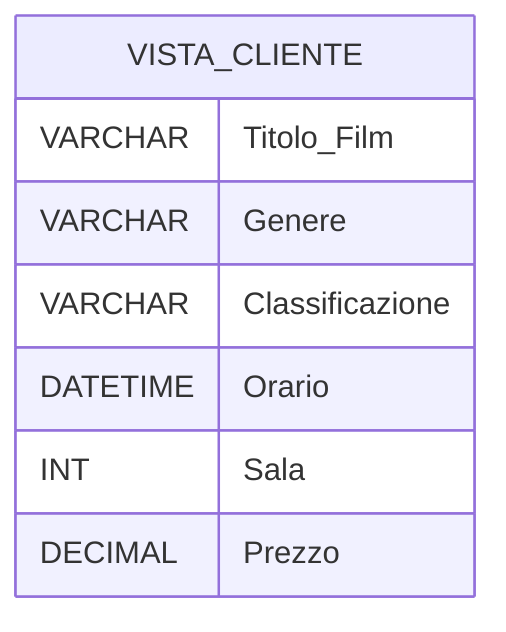
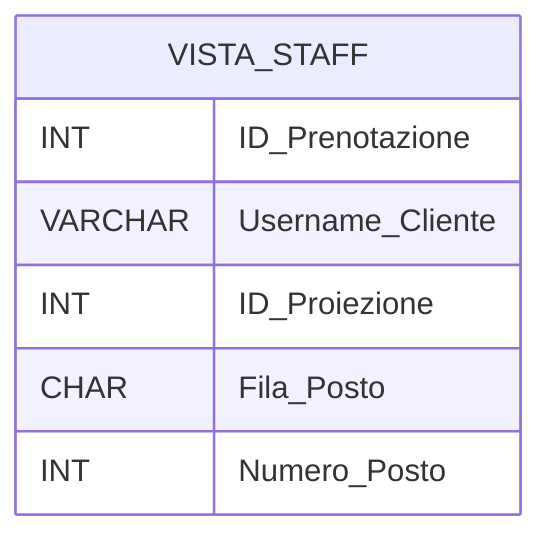
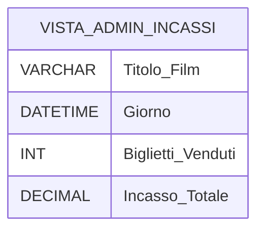

# **Appunti progetto Tor Vercinema**

>[!tip] Idea progetto
>
Costruiamo un database capace di gestire interamente la gestione di un cinema multisala.
>
**Perché un database relazionale è utile e indispensabile?** L'implementazione di un DBMS relazionale è strettamente necessaria per superare le gravi inefficienze delle gestioni manuali o basate su fogli di calcolo (es. Excel). Un database strutturato è l'unico strumento in grado di:
>
>1. **Gestire la Concorrenza:** Permette a centinaia di utenti di consultare il palinsesto e acquistare biglietti nello stesso istante, garantendo meccanismi di _lock_ che azzerano il rischio di overbooking (vendita dello stesso posto a due persone diverse).
  >  
>2. **Garantire l'Integrità dei Dati:** Tramite i vincoli, il database impedisce fisicamente l'errore umano, come programmare due film diversi nella stessa sala alla stessa ora, o assegnare a un cliente un posto che non esiste in quella determinata sala.
    >
>3. **Sicurezza e Astrazione:** Centralizza i dati in un unico luogo sicuro, permettendo di mostrare solo le informazioni pertinenti in base a chi effettua l'accesso (RBAC - Role Based Access Control), proteggendo i dati sensibili e finanziari.
>
>## Piccola descrizione
>
L'implementazione del database nasce per risolvere diverse inefficienze gestionali riscontrate nell'attuale modello cartaceo o basato su fogli di calcolo.
>
>- **Il Cliente (Utente Finale)** ha il bisogno primario di evitare le code fisiche in cassa, assicurandosi il posto desiderato prima di arrivare al cinema. Necessita di un'interfaccia veloce per consultare gli orari e verificare la disponibilità dei posti.
    >
>- **L'Amministratore (Gestore)** ha bisogno di centralizzare i dati. La necessità principale è avere uno strumento che impedisca automaticamente l'errore umano e che fornisca dati finanziari in tempo reale (incassi) per decidere quali film tenere in programmazione.
    >
>- **Lo Staff (Operatore)** necessita di uno strumento rapido per validare i titoli di accesso all'ingresso della sala, senza dover accedere ai dati sensibili o finanziari degli utenti.
## Glossario dei Termini (Analisi dei Requisiti)

| **Termine**      | **Descrizione**                                                                                              | **Sinonimi / Collegamenti** |
| ---------------- | ------------------------------------------------------------------------------------------------------------ | --------------------------- |
| **Film**         | Opera cinematografica inserita nel catalogo del cinema.                                                      | Pellicola, Titolo           |
| **Sala**         | Ambiente fisico all'interno della struttura, identificato da un numero.                                      | -                           |
| **Posto**        | Singola seduta fisica prenotabile, definita da una Fila e un Numero.                                         | Poltrona, Sedile            |
| **Proiezione**   | Singolo evento a palinsesto che lega un Film a una Sala in una data e ora specifica.                         | Spettacolo, Evento          |
| **Prenotazione** | Atto di acquisto/registrazione che garantisce a un Utente l'accesso a un Posto specifico per una Proiezione. | Biglietto, Ticket           |
## Seconda parte: Normative esistenti e realizzazioni preesistenti:

- **Verifica Età per Classificazione Film:** Per acquistare un biglietto il cliente deve rispettare il limite di età imposto dalla classificazione del film. Un cliente con età minore rispetto a quella consentita dalla specifica proiezione non avrà la possibi
- ità di finalizzare l’acquisto.
    
- **Politica di Annullamento Prenotazioni:** Annullamento della prenotazione, è possibile procedere con l’annullamento gratuito entro 4 ore prima del’ inizio della proiezione.
    
- **Vincolo di Occupazione Posto:** Rispettare i dettagli e le specifiche scritte sulla prenotazione, non è possibile occupare un posto all’interno della sala che sia differente a quello inciso sul biglietto.
    
- **Regolamento Accesso in Sala:** L’accesso alla sala è consentito 15 minuti prima dall’inizio della proiezione, non sono presenti restrizioni particolari per chi entra in sala dopo l’inizio della proiezione.
    
- **Gestione Riduzioni (Sconto Young & Senior):** Previsto uno sconto del venti percento sul prezzo totale del biglietto per chi è under 18 (Sconto Young) e over 65 (Sconto Senior).

>[!tips] Gestione sconti
>Gli sconti si calcolano tramite una **Stored Procedure** o una **Computed Column** che verifica se la differenza tra l'anno corrente e l'anno di `Data_Nascita` è `< 18` o `> 65`, applicando il moltiplicatore `0.8` al prezzo base.

---

### Realizzazioni preesistenti

Attualmente, la gestione del cinema è affidata a un sistema eterogeneo e frammentato, basato prevalentemente su **metodi manuali e applicativi legacy** che presentano criticità in termini di efficienza e sicurezza dei dati:

- **Sistemi da rimpiazzare:** Il cuore della gestione attuale poggia su fogli di calcolo elettronici (Excel) per la programmazione del palinsesto e registri cartacei per la spunta dei posti in sala. Questa modalità genera frequenti rischi di ridondanza dei dati, errori umani nella trascrizione degli orari e, soprattutto, l'impossibilità di gestire le prenotazioni in tempo reale, causando talvolta fenomeni di overbooking. Il nuovo sistema centralizzato andrà a sostituire integralmente questi strumenti, migrando i dati in un database relazionale protetto e coerente.
    
- **Applicazioni interagenti:** Il sistema progettato non sarà un'entità isolata, ma è predisposto per dialogare con i seguenti moduli esterni:
    
    - **Gateway di Pagamento:** Il modulo di prenotazione interagirà tramite API con servizi esterni (come Stripe o PayPal) per la validazione delle transazioni finanziarie.
        
    - **Servizio Mail/Notifiche:** Un sistema di messaggistica automatico sarà integrato per l'invio istantaneo della conferma di prenotazione e del biglietto digitale (QR Code) all'utente finale.
        
    - **Modulo di Controllo Accessi:** Il database fornirà le credenziali necessarie alle postazioni hardware poste all'ingresso delle sale per la scansione e la validazione in tempo reale dei titoli d'ingresso.
### 1. Schema concettuale (entita e relazioni)

Solo l'idea del database come lo abbiamo fatto su carta praticamente

- **Film**: Rappresenta il film: 
	- Titolo  
	- Durata
	- Regista
	- Classificazione (es. T, VM14, VM18)

- **Generi:** 
	- Nome_Genere

- **Film_Generi:**
	- FK_Film
	- FK_Gemeri

- **Sala**: Lo spazio fisico:
	- Numero
	- Capienza Totale

- **Posto**: La singola poltrona: 
	- Fila 
	- Numero

- **Proiezione**: L'evento specifico. Collega un Film a una Sala in un determinato Orario.
	- Data/ora
	- Prezzo

- **Utente**: Chi accede al sistema:
	- Username
	- Email 
	- Ruolo
	- Data di nascita

- **Prenotazione**: L'atto d'acquisto che lega un Utente a una Proiezione e a un Posto specifico.
	- Data_acquisto

>[!quote] Vincoli
>- **Vincolo di Unicità**: La coppia (_ID_Proiezione_, _ID_Posto_) nella tabella Prenotazione deve essere unica (un posto non può essere venduto due volte per lo stesso spettacolo).
>
>- **Vincolo di Coerenza**: Il numero di Prenotazioni per una Proiezione non può superare la `Capienza_Totale` della Sala associata.
>
>- **Vincolo di Corrispondenza (Integrità Spaziale):** Un Posto può essere inserito in una Prenotazione _solo se_ appartiene fisicamente alla Sala in cui è programmata la Proiezione (il `FK_Sala` del Posto deve coincidere con il `FK_Sala` della Proiezione).
>
>- **_Vincolo di Check (Business Rule):_** Il campo `Ruolo` può assumere solo i valori `('Cliente', 'Admin', 'Staff')`
>
>- **Vincoli di Dominio (Check Rules):**
>	- Ruolo IN ('Cliente', 'Admin', 'Staff').
>	- Classificazione IN ('T', 'VM14', 'VM18').
>	- Prezzo > 0 (Non esistono biglietti con prezzo negativo).
>	- Durata > 0.
>	- Capienza_Totale > 0.
>	- Fila BETWEEN 'A' AND 'Z' (Le file sono solo lettere dell'alfabeto).
>	- Età > 0

### 2. Schema logico (relazionale)
### 1. FILM

Contiene l'anagrafica delle pellicole.

- **ID_Film**: `INT` (PK, AUTO_INCREMENT) — Identificativo univoco.
    
- **Titolo**: `VARCHAR(255)` (NOT NULL) — Titolo del film.
    
- **Durata**: `INT` — Durata in minuti.
    
- **Regista**: `VARCHAR(255)` — Nome e cognome del regista.

- **Classificazione:** `VARCHAR(4)` — Classificazione del film (es. T, VM14, VM18)

### 2. GENERI

- **ID_Genere:** INT (PK) — Identificativo del genere.
- **Nome_Genere:** VARCHAR(50) — (es. Azione, Horror, Commedia).

### 3. FILM-GENERI

- **FK_Film:** INT (FK) — Riferimento a FILM.
- **FK_Genere:** INT (FK) — Riferimento a GENERI.
- (La combinazione delle due FK costituisce la Chiave Primaria).

### 4. SALA

Rappresenta lo spazio fisico.

- **ID_Sala**: `INT` (PK) — Numero o ID della sala.
    
- **Capienza_Totale**: `INT` — Numero massimo di posti disponibili.
    

### 5. POSTO

La singola seduta all'interno di una sala.

- **ID_Posto**: `INT` (PK) — Identificativo univoco del posto.
    
- **Fila**: `CHAR(1)` — Lettera della fila (es. 'A', 'B').
    
- **Numero**: `INT` — Numero del posto nella fila.
    
- **FK_Sala**: `INT` (FK) — Riferimento a `SALA(ID_Sala)`.
    

### 6. PROIEZIONE

L'evento che unisce film, sala e tempo.

- **ID_Proiezione**: `INT` (PK) — Identificativo dell'evento.
    
- **Data_Ora**: `DATETIME` — Data e orario di inizio.
    
- **Prezzo**: `DECIMAL(5,2)` — Costo del biglietto (es. 10.50).
    
- **FK_Film**: `INT` (FK) — Riferimento a `FILM(ID_Film)`.
    
- **FK_Sala**: `INT` (FK) — Riferimento a `SALA(ID_Sala)`.
    

### 7. UTENTE

Gestione degli accessi e dei ruoli.

- **ID_Utente**: `INT` (PK) — Identificativo utente.
    
- **Username**: `VARCHAR(50)` (UNIQUE) — Nome utente univoco.
    
- **Email**: `VARCHAR(100)` (UNIQUE) — Indirizzo email.
    
- **Password**: `VARCHAR(255)` — Hash della password per la sicurezza. 
	> Importante ricorda che i database non salvano mai le password cosi come sono li nasce la necessità di un algoritmo Hash salviamo il risultato.
	
- **Data_Nascita**: `DATE` - Fondamentale per il calcolo automatico dell'età, che serve per la classificazione e gli sconti
    
- **Ruolo**: `ENUM('Cliente', 'Staff', 'Admin')` — Ruolo per la gestione dei permessi.
    

### 8. PRENOTAZIONE

Associazione tra l'utente e lo spettacolo scelto.

- **ID_Prenotazione**: `INT` (PK) — Numero del ticket.
    
- **Data_Acquisto**: `TIMESTAMP` (DEFAULT CURRENT_TIMESTAMP) — Momento della transazione.
    
- **FK_Utente**: `INT` (FK) — Riferimento a `UTENTE(ID_Utente)`.
    
- **FK_Proiezione**: `INT` (FK) — Riferimento a `PROIEZIONE(ID_Proiezione)`.
    
- **FK_Posto**: `INT` (FK) — Riferimento a `POSTO(ID_Posto)`.

![[Schema -ER.png]]

>[!danger] Tabella scomoda
>Questa tabella non ha dati "descrittivi" (come titoli o nomi), ma contiene solo **coppie di numeri (ID)**:
>
>- **FK_Film:** punta all'ID del film.
>- **FK_Genere:** punta all'ID del genere.
>
>**Esempio pratico:**
>
>Se il Film ID 1 (_Matrix_) è sia Azione (Genere ID 5) che Sci-Fi (Genere ID 8), nella tabella ponte avrai:
>
>| **FK_Film** | **FK_Genere** | **PK Key** |
| ----------- | ------------- | -----|
| 1           | 5             | (1,5) |
| 1           | 8             |  (1,8) |
>
>Utilizziamo una **chiave primaria composta** formata dalle due chiavi esterne (`FK_Film` e `FK_Genere`). Questo garantisce l'integrità dei dati perché impedisce di associare lo stesso genere allo stesso film più di una volta, ottimizzando al contempo l'indice di ricerca."

---

## 4. Viste (Progettazione Fisica & Sicurezza)

Per rispettare le regole di visibilità e sicurezza, il database non espone mai le tabelle intere, ma utilizza delle **Viste (VIEW)** dedicate per ogni classe di utente.

### VISTA_CLIENTE (Il Palinsesto Pubblico)

Il cliente ha bisogno di vedere cosa c'è al cinema oggi, ma **non deve** vedere gli incassi o le mail degli altri utenti.

- **Tabelle coinvolte:** `FILM`, `PROIEZIONE`, `SALA`.
    
- **Cosa estrae:** Solo le proiezioni con `Data_Ora` futura (maggiore di oggi). Mostra il titolo del film, la durata, l'orario, la sala e il prezzo.

### VISTA_STAFF (Controllo Ingressi)

Lo staff alla porta deve solo "strappare i biglietti". Non gli interessa quanto ha incassato il cinema né qual è la password dell'utente.

- **Tabelle coinvolte:** `PRENOTAZIONE`, `UTENTE`, `POSTO`, `PROIEZIONE`.
    
- **Cosa estrae:** Mostra il numero del biglietto (`ID_Prenotazione`), lo Username (per chiedere il documento in caso di dubbi) e le coordinate del Posto (Fila e Numero) per far accomodare il cliente.
    

### VISTA_ADMIN (Cruscotto Direzionale)

L'amministratore vede tutto il database. Le sue viste sono spesso "Viste Materializzate" o funzioni di aggregazione per calcolare i soldi.

- **Tabelle coinvolte:** `PROIEZIONE`, `PRENOTAZIONE`, `FILM`.
    
- **Cosa estrae:** Somma dei prezzi (`SUM(Prezzo)`) raggruppati per `Data_Ora` o per `ID_Film`.
    

### Valutazione forme normali 

- ##### Prima forma normale:
Rispettata. Inizialmente il campo 'Genere' presentava valori non atomici (multivalore). Il problema è stato risolto tramite la creazione di una tabella di associazione (FILM_GENERI), garantendo che ogni attributo abbia ora un dominio atomico.

- ##### Seconda forma normale:
Rispettata. Tutte le tabelle hanno una chiave primaria atomica (ID surrogato). Non esistono dipendenze parziali: ogni attributo non chiave dipende dall'intera chiave primaria.

- ##### Terza forma normale:
Rispettata. Non sono presenti dipendenze transitive. Ogni attributo dipende solo dalla chiave primaria (es. la Capienza_Totale dipende solo dall'ID_Sala e non da attributi esterni alla tabella).

