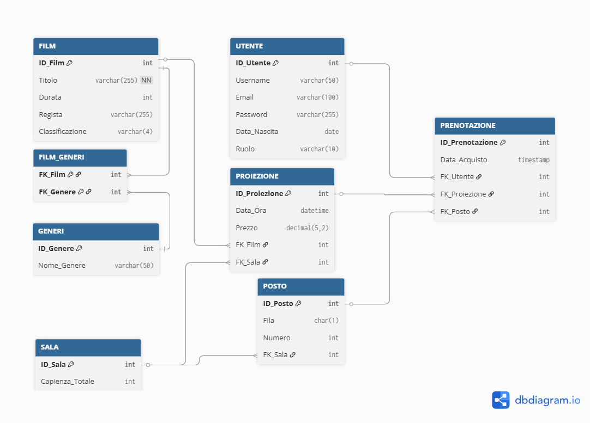

# 🎥 Tor Vercinema: Multisala Management System

> **Tor-Vercinema** è un sistema informativo avanzato progettato per la gestione operativa di un cinema multisala. Automatizza l'intero ciclo di vita cinematografico: dalla gestione delle anagrafiche alla programmazione del palinsesto, fino alla vendita sicura dei biglietti in tempo reale.

---

## 📐 Architettura del Database (Schema Logico)
Il cuore del sistema è strutturato per garantire scalabilità e coerenza dei dati. Di seguito la rappresentazione logica delle entità e delle loro relazioni:

---

## 💡 Idea del Progetto
L'obiettivo è fornire un'infrastruttura solida capace di gestire l'intero ecosistema di un cinema moderno. Il progetto si focalizza sulla risoluzione delle inefficienze dei sistemi manuali, centralizzando i dati per offrire un'esperienza fluida sia agli operatori che ai clienti.

## 🚀 Perché un Database Relazionale?
In un contesto dove la precisione è tutto, un **DBMS relazionale** è indispensabile per garantire:

* **⚡ Gestione della Concorrenza**: Supporto a centinaia di utenti simultanei, azzerando il rischio di *overbooking* attraverso meccanismi di lock e transazioni sicure.
* **🛡️ Integrità dei Dati**: Vincoli strutturali che impediscono errori umani (es. sovrapposizione di film nella stessa sala o assegnazione di posti inesistenti).
* **🔒 Sicurezza e Astrazione**: Implementazione del *Role Based Access Control (RBAC)* per proteggere i dati sensibili e finanziari.

---

## 📝 User Roles & Requirements
Il sistema risponde alle necessità specifiche di ogni attore coinvolto:

| Ruolo | Obiettivo Primario | Soluzione Tecnica |
| :--- | :--- | :--- |
| **👤 Cliente** | Zero code e posto garantito. | Consultazione e acquisto real-time. |
| **💼 Admin** | Controllo totale e analisi. | Automazione palinsesto e report incassi. |
| **🎫 Staff** | Rapidità agli ingressi. | Validazione ticket sicura e mirata. |

---

## 🛠️ Struttura del Repository
Il progetto segue un'organizzazione modulare e pulita:

* 📂 `DOCS/`: Specifiche tecniche, manuali e documentazione accademica.
* 📂 `DIAGRAMS/`: Schemi E-R (Concettuali e Logici) in alta risoluzione.
* 📂 `SQL/`: Script DDL per lo schema, DML per i dati di test e Query analitiche.
* 📂 `APP/`: *(Work in Progress)* Interfaccia web interattiva.

---

## ⚙️ Funzionalità & Vincoli di Business
* ✅ **Unicità Posto**: Impossibilità tecnica di vendere lo stesso posto per la stessa proiezione.
* ✅ **Capienza Dinamica**: Controllo automatico della saturazione delle sale.
* ✅ **Validità Spaziale**: Sistema di controllo che impedisce prenotazioni su sale errate.
* ✅ **Security First**: Archiviazione delle password tramite algoritmi di Hash (BCrypt).

---

## 👥 Autori
* **Dario Pimpini** - *Database Designer & Developer*
* **Daniele Panella** - *Database Designer & Developer*

---
*Progetto realizzato per il corso di "Basi di Dati e di Conoscenza" - Università di Roma Tor Vergata*
